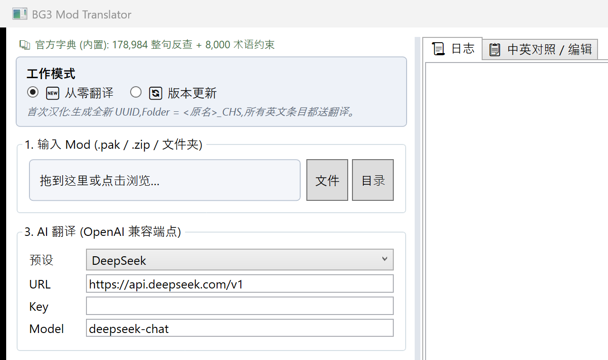

# BG3 Mod Translator

> 把 Baldur's Gate 3 的 mod 一键打包成独立中文化包,版本升级时自动复用旧译,玩家无感切换。


你下了喜欢的 mod,作者只发英文;原汉化作者跑了,新版又没人接。这工具就是为这种场景做的——把 mod 拖进窗口、点一个按钮,产出一个**独立**的 `_CHS.pak`,直接丢 BG3MM 就能用。升级时塞一份旧 CHS,工具沿用 UUID,旧存档无感继续。

---

## ✨ 功能

- 📦 **拖入即用** — 支持 `.pak` / `.zip` (BG3MM 格式) / 已解包文件夹三种输入
- 🔄 **升级模式** — 提供旧 CHS 包作参考,自动沿用 UUID/Folder,英文未变的条目复用旧译,只重译新增/改动
- 📚 **官方字典内置** — 从游戏简中 `.pak` 提取的 232K 整句反查 + 8000 条术语强约束 prompt 注入,全打进 exe(单文件 86 MB,无外部依赖)
- 🤖 **多翻译后端** — Databricks Claude / DeepSeek / OpenAI / Ollama 任选;Google Free 兜底零配置
- 🛡️ **占位符校验** — `[1]` `<LSTag/>` `&entity;` `{0}` 自动检查,不达标自动回退原文
- 🧱 **版本防降** — Chinese loca version ≥ English version,杜绝游戏取错语言显示英文
- 📤 **BG3MM 一步出包** — 同时输出 `<Mod>_CHS.pak` + `<Mod>_CHS.zip`(含 `info.json` + MD5),可直传 Nexus
- 💾 **本地缓存** — SQLite 跨任务复用,改名 / 重打包 / 同 mod 多次跑都不浪费 token

---

## 📸 截图



> 中英对照编辑表 + 升级模式截图待补(欢迎贡献:载入一个 mod 跑一次后截图 PR 过来)

---

## 🚀 用法

### 快速上手(普通玩家 / 第一次给某 mod 做汉化)

1️⃣ 从 [Releases](https://github.com/Jcxu97/bg3-mod-translator/releases) 下 `BG3LocTool.App.exe`,双击启动(无需安装)
2️⃣ 把 mod 文件(`.pak` / Nexus 下载的 `.zip` / 解包后的文件夹)拖进左侧第 1 框
3️⃣ 第 3 框选翻译后端(推荐 **Databricks** 或 **DeepSeek**,质量最稳;懒得办 key 选 "Google Free")
4️⃣ 第 4 框填作者名 + 版本号(默认 `1.0.0.1` 即可)
5️⃣ 第 5 框选输出目录,然后点 **⚡ 一键生成**

跑完在你指定的目录里有 `<Mod>_CHS.pak` 和 `<Mod>_CHS.zip`,把 zip 拖进 BG3MM 加载顺序里就行。

### 升级旧 CHS 包(汉化作者 / 接盘老 mod)

原作者发新版了,不想从零重译:

1️⃣ 顶部切到 **🔄 版本更新** 模式
2️⃣ 第 1 框拖**新版英文 mod**;第 2 框拖**旧 CHS 包**
3️⃣ 一键生成 → 工具沿用旧 CHS 的 UUID/Folder,英文没动的条目用旧译,只把新增/改动的条目送 AI

玩家更新 CHS 时存档完全无感(因为 UUID 没变,BG3MM 视为同一个 mod)。

### 编辑生成结果

跑完后在右侧 **📋 中英对照 / 编辑** Tab 可以直接改译文,改完点 **💾 保存** + **📦 导出 pak** 重新出包,无需再调 AI。

---

## 🔧 翻译后端

| 后端 | 免费 | 中文质量 | 需要 Key | 适用场景 |
|---|---|---|---|---|
| **Databricks Claude** | ❌ 按 token 收费 | ⭐⭐⭐⭐⭐ | 是 | 想要最高质量,术语约束生效 |
| **DeepSeek** | 💰 极便宜(¥1/M tokens 量级) | ⭐⭐⭐⭐ | 是 | 性价比首选 |
| **OpenAI 兼容** | ❌ | ⭐⭐⭐⭐ | 是 | 已有 OpenAI / 智谱 / 百炼 / Moonshot 等 key |
| **Ollama** | ✅ 本地 | ⭐⭐⭐(看模型) | 否 | 离线 / 隐私敏感;推荐 `qwen2.5:14b+` |
| **Google Free** | ✅ | ⭐⭐ | 否 | 临时应急 / 试水(注意:不走术语强约束 prompt) |

**注意**:只有 OpenAI 兼容路径走完整的 `术语字典强约束 prompt → 输出后校验 → 失败重试` 闭环。Google Free 走机翻 API,术语对齐主要靠工具的整句反查兜底。

---

## 🛡️ 质量保证

工具不是只把英文丢给 AI 就完事——所有结果都过这一串:

1. **整句反查** — 命中游戏简中 232K 库存句子时,直接用官方译文,跳过 AI(比如 mod 里出现 "Fire Bolt" 这种 vanilla 法术名,直接拿官方"火焰箭")
2. **术语 prompt 强约束** — 翻译时按句扫出涉及的 vanilla 术语,把 `Tadpole=寄生蝌蚪 / Lathander=洛山达 / Mind Flayer=夺心魔` 这类映射注入 system prompt
3. **占位符校验** — 译文必须保留所有 `[1]` `<LSTag.../>` `&entity;` `{0}`;一旦丢失或形变直接回退原文,绝不出 broken 文本
4. **术语校验** — 输出后再扫一遍是否所有命中术语都用了对的中文,不达标 → 带 missing 列表 retry strict prompt
5. **版本防降** — 自动确保 Chinese loca version ≥ English version,避免游戏取错语言
6. **本地 SQLite 缓存** — `(英文原文 → 译文)` 跨 mod 跨任务复用,同样的英文不再花第二次 token

---

## 🗺️ Roadmap

- [ ] 升级模式沿用旧 `Group` UUID(v1 暂时新生成,玩家手调加载顺序;v2 修)
- [ ] 全局 typo 修正阶段(参考内部 spec Step 6)
- [ ] 支持 pak 内"裸 Localization"目录(没有 `Mods/` 包裹的特殊 mod)
- [ ] DeepL Free / Microsoft Translator 免费层后端
- [ ] Patch 7+ mod 默认补 `GustavX` + `GustavDev` 双依赖(实证 83/83 mod 都需要)

---

## ❓ FAQ

**Q: 为什么不直接等原 mod 作者出官方汉化?**
A: 大量 mod 作者只懂英文,绝大多数 mod 永远不会有官方中文。这工具的目标就是让你不必依赖任何人,自己 5 分钟出一份能用的汉化。

**Q: 装了这个 CHS 包,以后 mod 升级会不会冲突?**
A: 不会。CHS 包是**独立**的 .pak,通过全局 contentuid 合并机制覆盖原 mod 文本。原 mod 怎么升都不影响,你只需要重新跑一次工具(升级模式)生成新版 CHS。

**Q: 旧存档会坏吗?**
A: 升级模式下不会——UUID/Folder 沿用,BG3MM 视为同一个 mod。从零模式生成的是新 mod,旧存档第一次加载会提示 mod 列表变更,但不影响进度。

**Q: 这 232K 整句字典哪来的?合法吗?**
A: 从你本地正版游戏 `Localization/Chinese/Chinese.pak` 解包出来,只用做术语对齐,不分发原始 .pak 文件。字典内容只在你的 exe 内部用,不上传任何地方。

**Q: 为什么不让我选目标语言(日文/韩文)?**
A: 当前版本核心卖点是**对齐 BG3 官方简中术语**,字典是简中专属。其他语言可以走纯 AI 翻译但术语对不齐——v2 考虑开放但优先级不高。

**Q: Patch 9 出了怎么办?**
A: 字典需要从新版 Chinese.pak 重新提取打包。工具本体的 LSLib 也要随版升级。届时发新 release。

**Q: Mod Fixer 要不要装?**
A: **不要**。Patch 8 起 Mod Fixer 反而会破坏 mod 加载,必须卸载(社区共识)。

---

## 🔨 开发构建

```bash
git clone https://github.com/Jcxu97/bg3-mod-translator
cd bg3-mod-translator
dotnet build
dotnet run --project src/BG3LocTool.App
```

发布单文件 exe(86 MB,自带 .NET runtime + LSLib + 字典):

```bash
dotnet publish src/BG3LocTool.App -c Release -r win-x64 --self-contained \
  -p:PublishSingleFile=true -p:IncludeNativeLibrariesForSelfExtract=true
```

打 Release tag(`v*`)后 GitHub Actions 自动构建并上传到 Releases。

### 项目结构

```
src/
├── BG3LocTool.App/         # WPF 主程序 (MVVM)
├── BG3LocTool.Core/        # PakHandler / LocaIO / MetaEditor /
│                           # TranslationPipeline / TranslationCache /
│                           # PlaceholderValidator / Bg3OfficialGlossary
└── BG3LocTool.Translators/ # ITranslator / GoogleFreeTranslator /
                            # OpenAICompatibleTranslator
lib/lslib/                  # LSLib (Norbyte) — pak/lsx/loca 读写,bundled
```

### 依赖

- [LSLib](https://github.com/Norbyte/lslib) (Norbyte) — BG3 pak/lsx/loca 读写
- [CommunityToolkit.Mvvm](https://github.com/CommunityToolkit/dotnet) — MVVM helpers
- [Microsoft.Data.Sqlite](https://learn.microsoft.com/en-us/dotnet/standard/data/sqlite/) — 翻译缓存

---

## 📝 License

MIT(本工具)。LSLib 由 Norbyte 发布于其原仓库,遵循其各自 license。游戏简中字典派生自正版 BG3 安装,仅用作术语对齐,不再分发原始数据。
